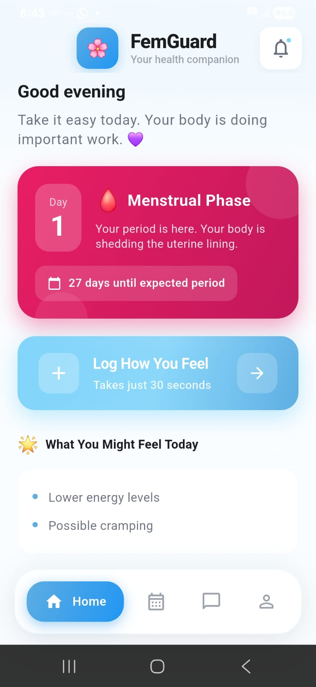
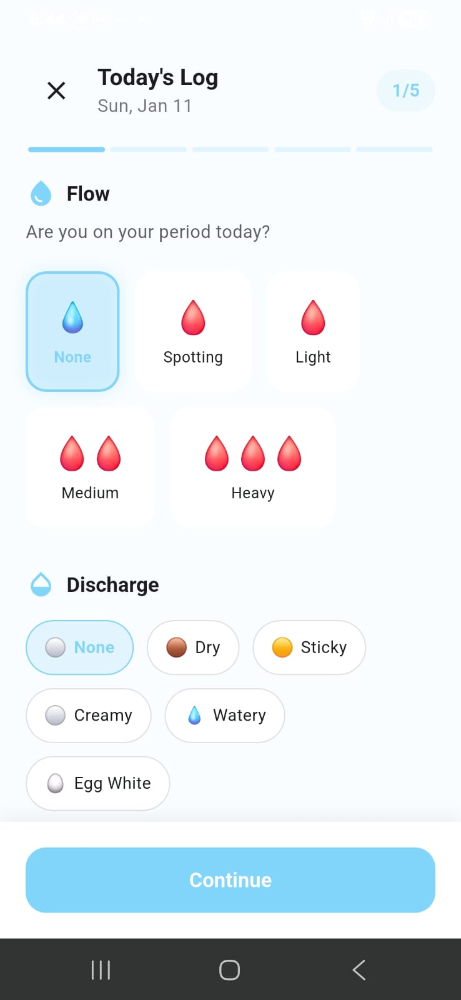
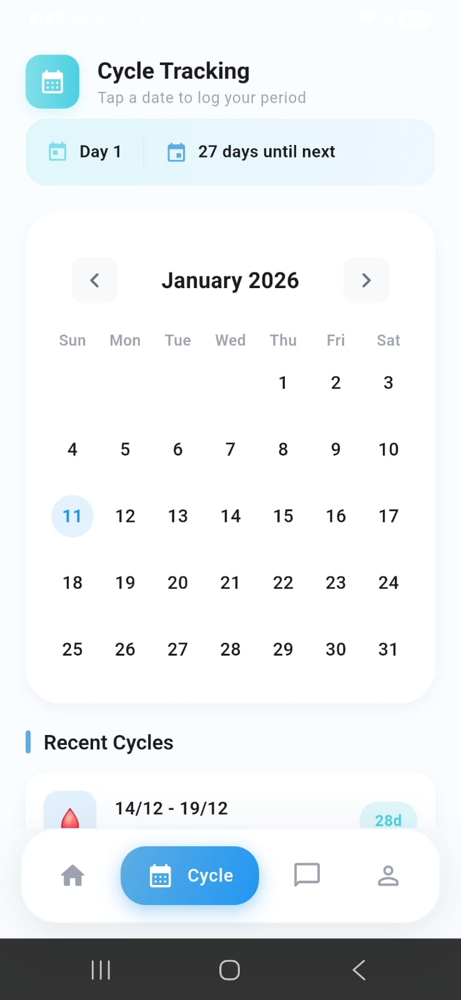
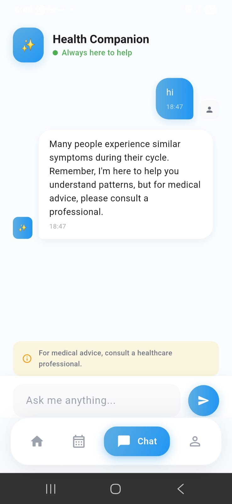

# 🌸 FemGuard - Menstrual & Hormonal Health Guardian

<p align="center">
  
</p>

<p align="center">
  <b>Your Personal Health Companion for Menstrual & Hormonal Wellness</b>
</p>

<p align="center">
  
  
  
  
</p>

---

## 📱 About

**FemGuard** is a comprehensive mobile application designed to help users track and understand their menstrual and hormonal health patterns. The app provides cycle tracking, symptom logging, lifestyle monitoring, AI-powered insights, and health awareness features.

> ⚠️ **Important:** This app is for awareness purposes only and does NOT provide medical diagnoses. Users should always consult healthcare professionals for medical concerns.

---

## 📸 Screenshots

<p align="center">
  
  &nbsp;&nbsp;&nbsp;
  
  &nbsp;&nbsp;&nbsp;
  
  &nbsp;&nbsp;&nbsp;
  
</p>

<p align="center">
  <b>Home Dashboard</b> &nbsp;&nbsp;&nbsp;&nbsp;&nbsp;&nbsp;&nbsp;&nbsp;&nbsp;&nbsp;&nbsp;&nbsp;&nbsp;&nbsp;&nbsp;&nbsp;&nbsp;&nbsp;&nbsp;&nbsp;
  <b>Symptom Logging</b> &nbsp;&nbsp;&nbsp;&nbsp;&nbsp;&nbsp;&nbsp;&nbsp;&nbsp;&nbsp;&nbsp;&nbsp;&nbsp;&nbsp;&nbsp;&nbsp;&nbsp;&nbsp;&nbsp;&nbsp;
  <b>Cycle Tracking</b> &nbsp;&nbsp;&nbsp;&nbsp;&nbsp;&nbsp;&nbsp;&nbsp;&nbsp;&nbsp;&nbsp;&nbsp;&nbsp;&nbsp;&nbsp;&nbsp;&nbsp;&nbsp;&nbsp;&nbsp;
  <b>AI Chat Companion</b>
</p>

---

## ✨ Features

### 🗓️ Cycle Tracking

- Log period start and end dates
- Interactive calendar with TableCalendar
- View cycle history
- Predict next period date
- Track cycle day

### 📝 Symptom Logging

- Track flow levels (None, Spotting, Light, Medium, Heavy)
- Track discharge types (Dry, Sticky, Creamy, Watery, Egg White)
- Track mood and energy levels
- Quick symptom selection
- Add custom notes

### 🏃 Lifestyle Tracking

- Sleep hours logging (0-12 hours)
- Stress level tracking (0-10)
- Activity level selection (Sedentary, Light, Moderate, Active, Very Active)

### 🤖 AI Health Companion

- Interactive chat interface
- Pre-defined contextual responses
- Health-related Q&A support
- Always-available virtual assistant
- Medical advice reminders

### 📊 Health Insights

- Pattern-based observations
- Analysis summary
- Educational content
- Health status indicator (Green/Yellow/Orange)

### 📈 Reports & Analytics

- Cycle length trends (bar charts)
- Period length trends
- Symptom trends over time
- Visual data representation with FL Chart

### ⚠️ Risk Awareness

- Health status monitoring
- Orange alert counter system
- Doctor consultation suggestions
- Status level explanations

### 👩‍⚕️ Doctor Suggestions

- List of healthcare providers
- Specialty information
- Contact details
- Health summary generation

### 🎨 Theming

Five customizable color themes:

| Theme    | Emoji | Description        |
| -------- | ----- | ------------------ |
| Rose     | 🌸    | Soft & feminine    |
| Ocean    | 🌊    | Calm & serene      |
| Forest   | 🌿    | Fresh & natural    |
| Lavender | 💜    | Soothing & elegant |
| Sunset   | 🌅    | Warm & vibrant     |

---

## 🛠️ Tech Stack

| Technology           | Description       |
| -------------------- | ----------------- |
| **Framework**        | Flutter 3.8.1+    |
| **Language**         | Dart              |
| **State Management** | Provider          |
| **Local Storage**    | SharedPreferences |
| **Calendar**         | table_calendar    |
| **Charts**           | fl_chart          |
| **Typography**       | Google Fonts      |

---

## 📦 Dependencies

```yaml
dependencies:
  flutter: sdk
  provider: ^6.1.2
  table_calendar: ^3.1.2
  fl_chart: ^0.69.0
  shared_preferences: ^2.3.3
  google_fonts: ^6.2.1
  cupertino_icons: ^1.0.8
```

---

## 🚀 Getting Started

### Prerequisites

- Flutter SDK ^3.8.1
- Dart SDK
- Android Studio / VS Code with Flutter extensions

### Installation

1. **Clone the repository**

   ```bash
   git clone https://github.com/prathamrajbhar/femguard.git
   cd mobileapp
   ```

2. **Install dependencies**

   ```bash
   flutter pub get
   ```

3. **Run the app**
   ```bash
   flutter run
   ```

### Build Commands

```bash
# Android APK
flutter build apk

# Android App Bundle
flutter build appbundle

# iOS
flutter build ios

# Web
flutter build web

# Windows
flutter build windows
```

---

## 📂 Project Structure

```
lib/
├── main.dart                    # App entry point
├── dummy_data/
│   └── dummy_data.dart         # Sample/demo data
├── models/
│   ├── chat_message.dart       # Chat message model
│   ├── cycle_model.dart        # Menstrual cycle data model
│   ├── doctor_model.dart       # Doctor information model
│   ├── lifestyle_log.dart      # Lifestyle tracking model
│   ├── symptom_log.dart        # Symptom logging model
│   └── user_model.dart         # User profile model
├── screens/                     # All app screens
├── services/
│   └── app_state.dart          # Global state management
├── utils/
│   ├── app_theme.dart          # Theme configuration
│   └── constants.dart          # App constants
└── widgets/                     # Reusable widgets
```

---

## 🧭 User Flow

```
First Launch:
Splash Screen → Onboarding → Consent → Theme Selection → Profile Setup → Home

Regular Use:
Splash Screen → Home Dashboard

Main Navigation (Bottom Nav):
├── 🏠 Home (Dashboard)
├── 📅 Cycle (Tracking Calendar)
├── 💬 Chat (AI Companion)
└── 👤 Profile (Settings)
```

---

## ⚠️ Disclaimer

This app is designed for **health awareness only**:

- ❌ Does NOT provide medical diagnosis
- ✅ All insights are for awareness purposes only
- ✅ User maintains complete control over their data
- ❌ No data is shared with third parties
- ✅ Always consult healthcare professionals for medical concerns

---

## 📄 License

This is a private project developed for PDPU Hackathon 2026.

---

## 👥 Team

Developed with ❤️ for **PDPU Hackathon 2026**

---

## 📞 Contact

For any queries or support, please reach out to the development team.

---

<p align="center">
  Made with 💕 in Flutter
</p>
